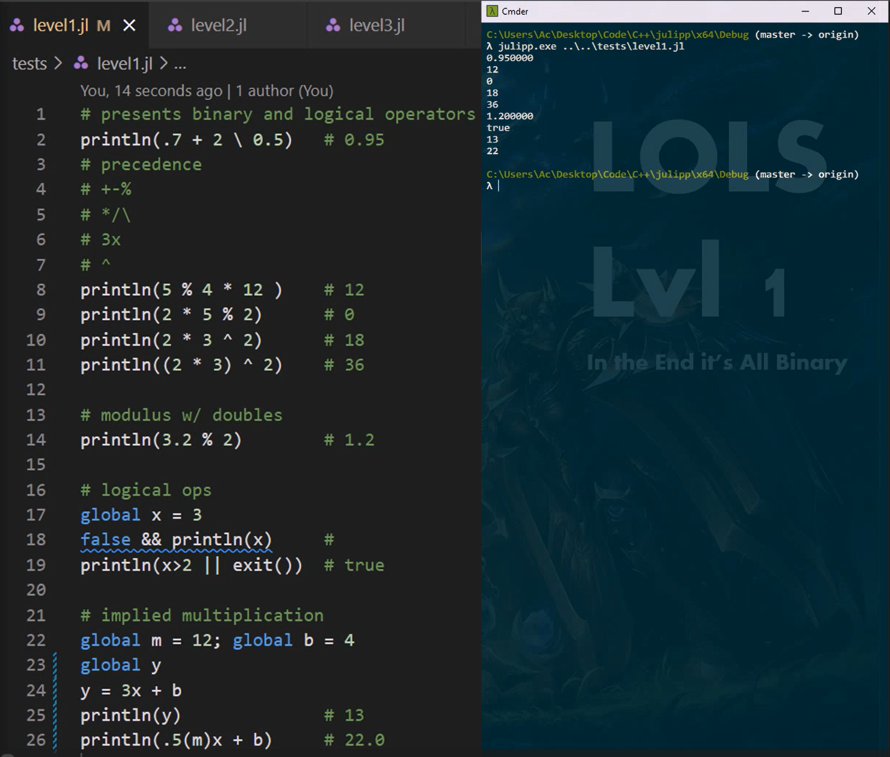
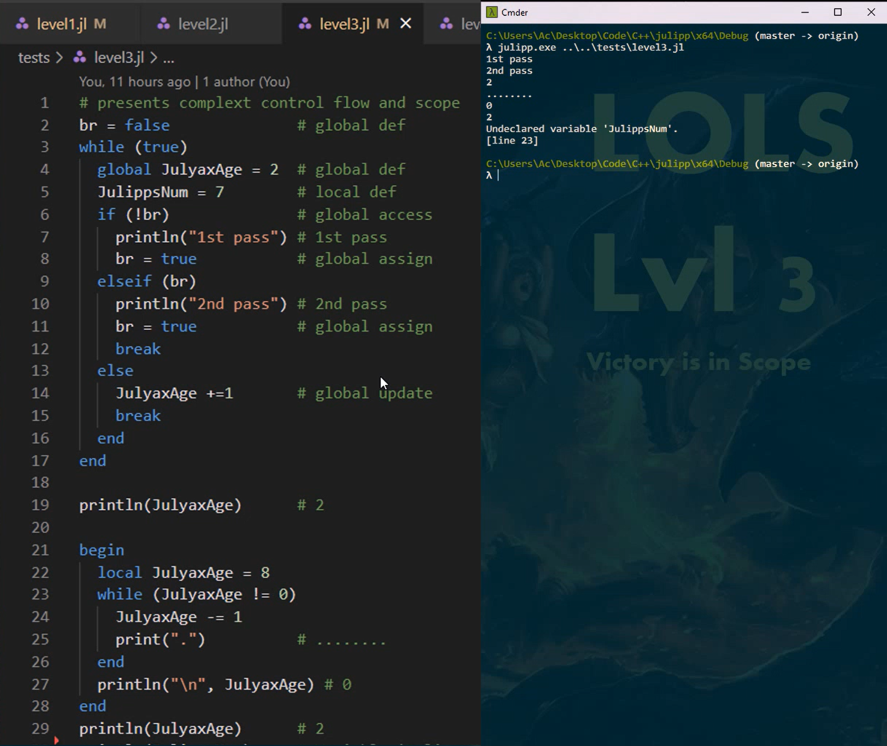
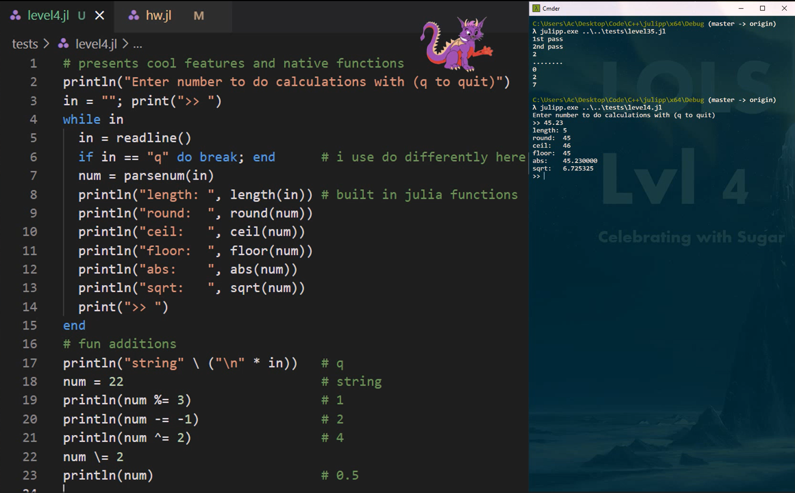
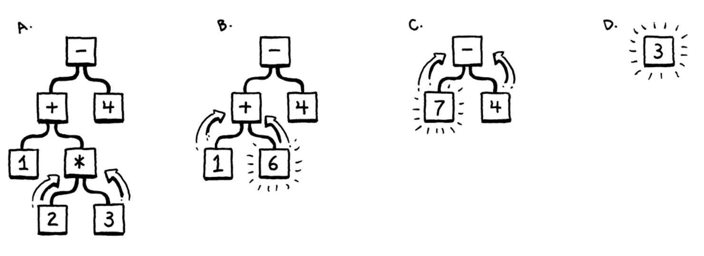

# Julipp
[Capabilities](#capabilities) | [How to Run](#how-to-run) | [Architecture](#architecture) | [Limitations](#limitations)
## Capabilities
Julipp interprets much of the standard Julia language (around version 1.8). This includes:
* literals
* unary operators
* binary operators
* implicit multiplication
* logical operators
* updating operators
* conditionals
* statements
* variables
* local scope
* global scope
* loops
* various string delimiters
* functions
* and more!

Below are some examples of the interpreter at work. Among the basic arithmetic operations we can see more advanced functionality, such as implicit multiplication (lines 24 & 26).

One of the most difficult pieces of Julia to implement was its complex scoping functionality. Julipp properly interprets the global and nested local scopes common to programming languages. Additionally, it implements Julia's distinction between "hard" and "soft" scopes which determines whether variables are shadowed or not. For example, while loops implement a "soft" scope while functions use "hard" scope.

As syntactic sugar, I built in several extra useful functions such as `println()` and `parsenum()`.

Note that Julipp only implements a subset of Julia and may not identically interpret every statement. If something seems critically wrong though. Feel free to submit a PR or issue. I might have fun diving into this project again.

## How to Run
1. Clone this repository.
2. Open the solution file in Visual Studio and build/run.

To interactively use interpreter, simply run from VS or, from the root of the repository:
~~~
x64\Debug\julipp.exe
~~~
To interpret a Julia file just provide the path:
~~~
x64\Debug\julipp.exe tests\loops.jl
~~~

## Architecture
The architecture of this interpreter follows the process presented in Robert Nystrom's free online book [Crafting Interpreters](https://craftinginterpreters.com/contents.html). It's far from a copy though. The book shows how to write an interpreter for Lox in Java. Julipp is an interpreter for Julia in C++.

When Julipp.exe receives a file or a "REPL" statement it first scans the code and creates specific tokens. The parser then parses keywords, literals, identifiers, and operators into an Abstract Syntax Tree (AST).

This tree is then traversed by the interpreter and executed as per the C++ equivalent. Other classes you might see in the source code handle errors (JError.cpp) or generate parts of the interpreter itself (generator.cpp).

## Limitations
Julipp only interprets a subset of the official Julia language. It cannot handle arrays or objects. For a detailed checklist of the interpreter's capabilities see [projectChecklist.md](./projectChecklist.md).

